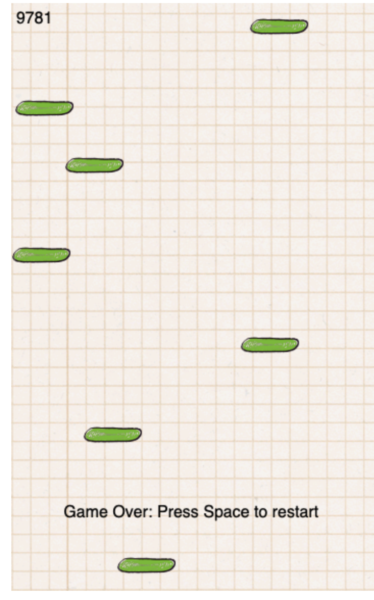
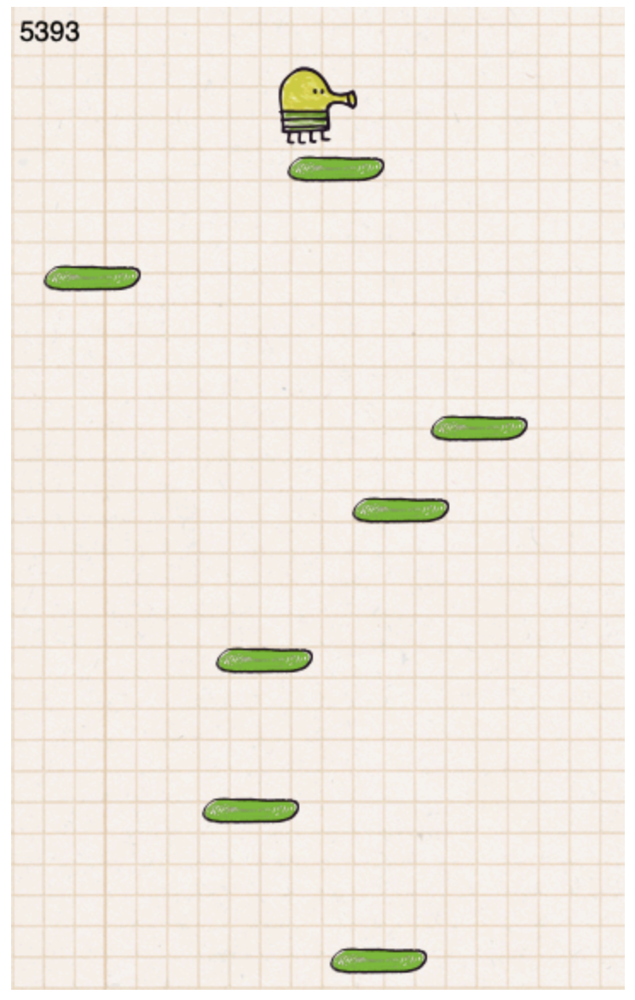

popular mobile game, doodle jump, using HTML canvas, game loop, adding images onto the canvas, adding click handlers to move the doodler jump and move left and right, applying game physics, randomly generating platforms and moving them down the screen, detecting collisions between the doodler and each platform, adding a running score, and reseting the game.

`GitHub Pages link:` https://jellyjul.github.io/Doodle-Jump/

